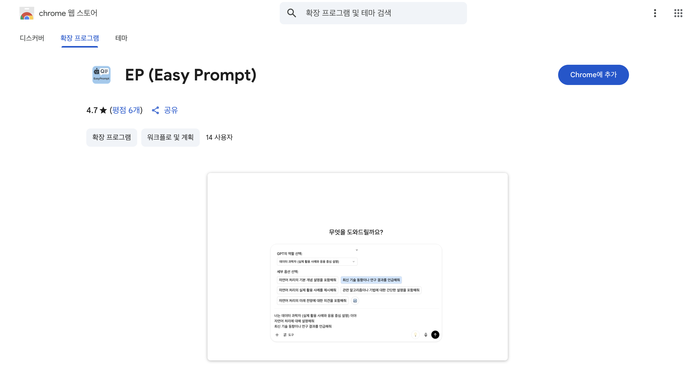
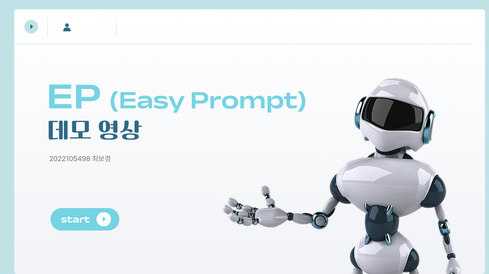

# 🤖 GPT 초보자를 위한 질문 자동 구조화 도구 - EP (Easy Prompt)

**Automatically refines your questions to get better answers from GPT.**  

---

## 📌 프로젝트 소개

**EP (Easy Prompt)** 는 GPT 사용자, 특히 초보자들이 더 나은 답변을 얻을 수 있도록 질문을 자동으로 구조화해주는 **크롬 확장 프로그램**입니다.  

사용자가 GPT 입력창에 간단한 질문을 입력하면, LLM을 이용해 GPT의 역할(role)과 질문 구체화 세부 옵션(option)을 자동 추천하고, 사용자는 클릭만으로 더 구체적이고 효과적인 질문을 만들 수 있습니다.

---

## 🛠 주요 기능

- 사용자의 질문을 자동 분석
- GPT API 기반 역할(role) + 세부 옵션(option) 자동 생성
- 드롭다운 & 버튼 기반 시각적 UI 제공 (ChatGPT 입력창 상단에 표시)
- 선택된 항목으로 자동 질문 재구성
- 재구성된 질문을 ChatGPT에 바로 입력하여 답변 얻기 가능

---

## 🚀 설치 방법

  

[Chrome Web Store](https://chromewebstore.google.com/detail/ep-easy-prompt/kfakockdmapaapeegdhcaecommhlanli?hl=ko) 에서 바로 설치가 가능합니다.

---

## 🧠 사용 예시

1. ChatGPT 창에 간단한 질문 입력 (예: "인공지능이 뭐야?")
2. 입력창 옆의 '💡' 버튼 클릭
3. EP 크롬 확장자가 자동으로 3개의 역할 + 5개의 옵션 제안
4. 드롭 다운 & 버튼 클릭으로 원하는 구성 선택
5. 재작성된 질문이 ChatGPT에 자동 입력됨
6. 더 구체적이고 유익한 답변 확인!

  

자세한 내용은 [EP 시연 영상](https://youtu.be/CHJcz6H5quk)을 통해 확인하세요.

---

## 🧩 기술 스택

- **Frontend**: Chrome Extension, HTML, CSS, JavaScript
- **LLM 연동**: GPT-4o (OpenAI API)
- **Backend**: Flask 서버 
- **서버 배포**: Render 이용
- **API 통신**: REST 기반 GPT 호출 (질문 전송 및 응답 수신)

---

## 🛤 향후 계획

- 다양한 LLM 모델(Mixtral, Claude 등) 연동 기능 추가
- 역할 및 옵션 이외의 질문 품질 향상 기능 추가
- ChatGPT 외 다른 생성 AI 확장

---

## 📬 문의

> GitHub: https://github.com/B0gyeong  
> Contact: chlqhrud0208@gmail.com
